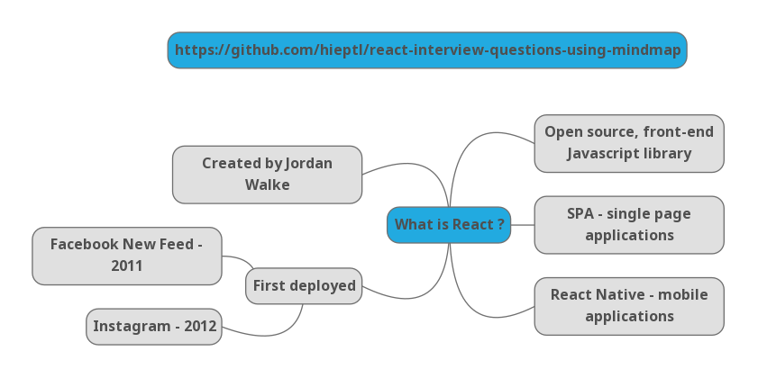
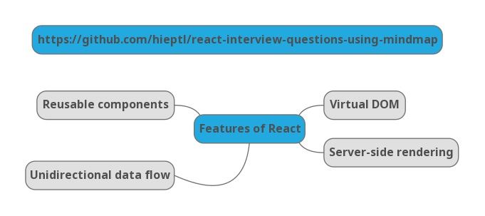
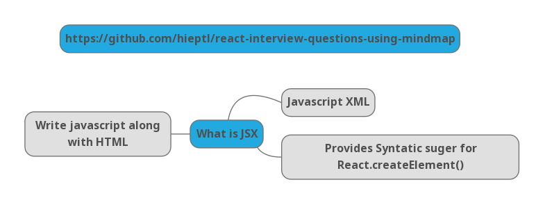
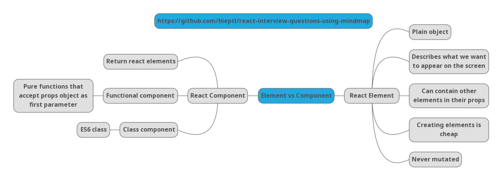
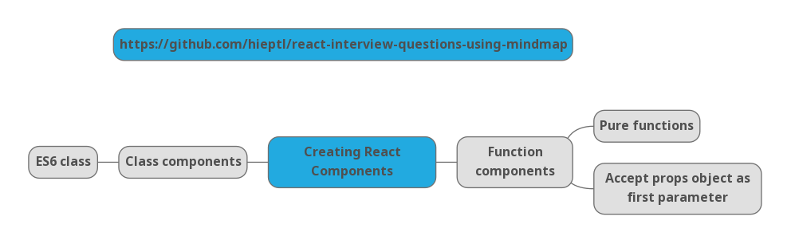
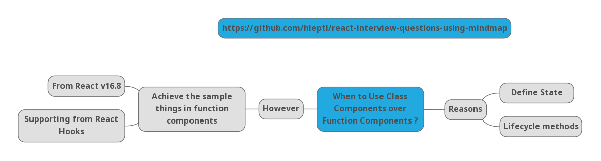
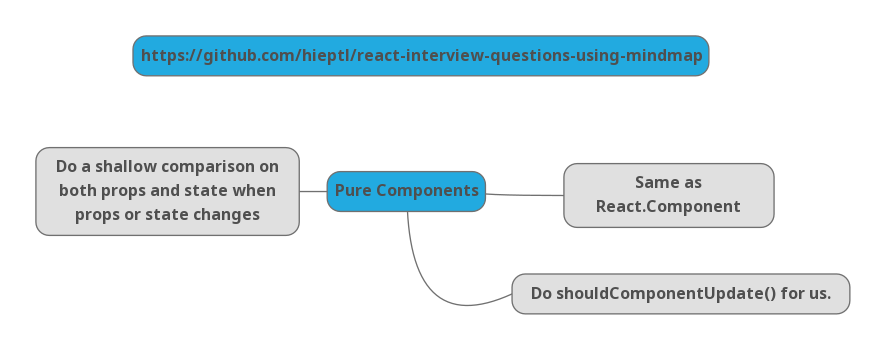
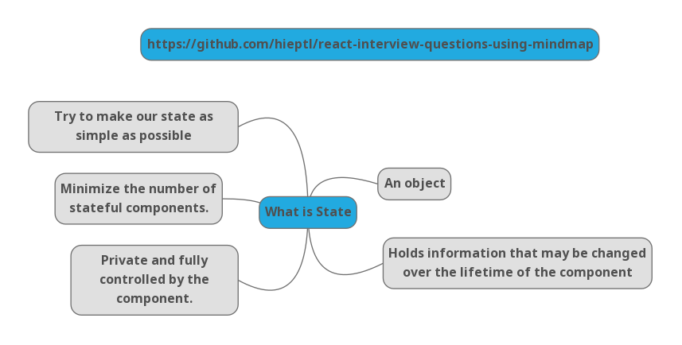
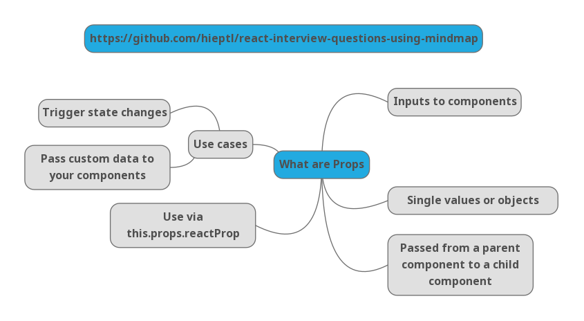
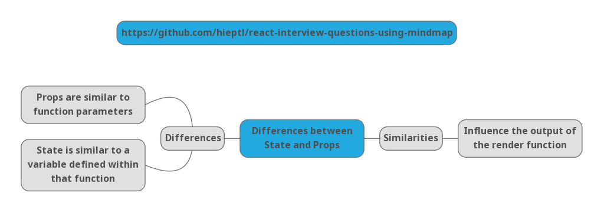

# Crack the React Interviews By Using Mindmap - Part 1.

This is the first part in my series (__Crach the React Interviews Using Mindmap__). My series will give you the answers about different React interview questions by using mindmap. Mindmap is a technique that help you remember things easier. It is used by many memory championships, professors, valedictorians and so on. 

By applying mindmap, my series will give you the key points for each answer. Hence, you can understand the answer and explain in your React interviews.

I'm Hiep. I work as a full-time software engineer. Most of my open-source projects are focused on one thing - to help people learn 📚.

I created a git repository that help you crack the React interviews by using mindmap.

> Github link: 
>
> https://github.com/hieptl/react-interview-questions-using-mindmap
> 
> If the repository is useful, please help me share the post and give me a Github's star. It will make me feel motivation to work even harder. I will try to make many open sources and share to the community :heart:.
>
> I also created some series that help you improve your practical skills: 
> 
> __1. Learn React By Buiding Netflix__ 
> 
> https://dev.to/hieptl/learn-react-by-building-netflix-1127
>
> __2. Master Design Patterns by Building Real Projects - Javascript.__
>
> https://dev.to/hieptl/series/13039
>
> __3. Some Mistakes When Using This Keyword in Javascript and Solutions__
>
> https://dev.to/hieptl/some-mistakes-when-using-this-keyword-in-javascript-and-solutions-4j77
>

## __Table of Contents__
| No. | Topics |
| --- | --------- |
|1  | [What is React?.](#question1) |
|2  | [What are the Features of React?.](#question2) |
|3  | [What is JSX?.](#question3) |
|4  | [What are the Differences between React Element and React Component?.](#question4) |
|5  | [How to Create Components in React?.](#question5) |
|6  | [When to use Class Components over Function Components?.](#question6) |
|7  | [What are Pure Components?.](#question7) |
|8  | [What is State in React?.](#question8) |
|9  | [What are props in React?.](#question9) |
|10  | [What are the differences between State and Props in React?.](#question10) |


## __Table of Images__
| No. | Topics |
| --- | --------- |
|1  | [Figure 1. Crack the React Interview by Using Mindmap - Question 1.](#figure1) |
|2  | [Figure 2. Crack the React Interview by Using Mindmap - Question 2.](#figure2) |
|3  | [Figure 3. Crack the React Interview by Using Mindmap - Question 3.](#figure3) |
|4  | [Figure 4. Crack the React Interview by Using Mindmap - Question 4.](#figure4) |
|5  | [Figure 5. Crack the React Interview by Using Mindmap - Question 5.](#figure5) |
|6  | [Figure 6. Crack the React Interview by Using Mindmap - Question 6.](#figure6) |
|7  | [Figure 7. Crack the React Interview by Using Mindmap - Question 7.](#figure7) |
|8  | [Figure 8. Crack the React Interview by Using Mindmap - Question 8.](#figure8) |
|9  | [Figure 9. Crack the React Interview by Using Mindmap - Question 9.](#figure9) |
|10  | [Figure 10. Crack the React Interview by Using Mindmap - Question 10.](#figure10) |


<a id="question1"></a>
### 1. What is React ? 

<a id="figure1"></a>


Figure 1. Crack the React Interview by Using Mindmap - Question 1.

<a id="question2"></a>
### 2. What are the Features of React ? 

<a id="figure2"></a>


Figure 2. Crack the React Interview by Using Mindmap - Question 2.

<a id="question3"></a>
### 3. What is JSX ? 

<a id="figure3"></a>


Figure 3. Crack the React Interview by Using Mindmap - Question 3.

Sample Code: 

```js
class App extends React.Component {
  render() {
    return(
      <div>
        <h1>{'Cracking the React Interviews by Using Mindmap'}</h1>
        <h2>{'Author: Hiep Le'}</h2>
        <h2>{'https://github.com/hieptl/react-interview-questions-using-mindmap'}</h2>
      </div>
    )
  }
}
```

<a id="question4"></a>
### 4. What are the Differences between React Element and React Component ? 

<a id="figure4"></a>


Figure 4. Crack the React Interview by Using Mindmap - Question 4.

<a id="question5"></a>
### 5. How to Create Componets in React ? 

<a id="figure5"></a>


Figure 5. Crack the React Interview by Using Mindmap - Question 5.

Example about a function component: 

```js
function Greeting({ message }) {
  return <h1>{`Hello, ${message}`}</h1>
}
```

Example about a class component:

```js
class Greeting extends React.Component {
  render() {
    return <h1>{`Hello, ${this.props.message}`}</h1>
  }
}
```

<a id="question6"></a>
### 6. When to Use Class Components Over Function Components ? 

<a id="figure6"></a>


Figure 6. Crack the React Interview by Using Mindmap - Question 6.


<a id="question7"></a>
### 7. What are Pure Components ? 

<a id="figure7"></a>


Figure 7. Crack the React Interview by Using Mindmap - Question 7.

<a id="question8"></a>
### 8. What is State in React ? 

<a id="figure8"></a>


Figure 8. Crack the React Interview by Using Mindmap - Question 8.

```js
class Course extends React.Component {
  constructor(props) {
    super(props)

    this.state = {
      title: 'Welcome to My Course'
    }
  }

  render() {
    return (
      <div>
        <h1>{this.state.title}</h1>
      </div>
    )
  }
}
```

<a id="question9"></a>
### 9. What are Props in React ? 

<a id="figure9"></a>


Figure 9. Crack the React Interview by Using Mindmap - Question 9.

```js
function Course({courseName}) { 
  return (
    <div>
      <h1>{courseName}</h1>
    </div>
  );
}
```

<a id="question10"></a>
### 10. What are the Differences between State and Props in React ? 

<a id="figure10"></a>


Figure 10. Crack the React Interview by Using Mindmap - Question 10.

This is the end of the first part. I am writing the next parts, you just need to follow my series and we will crack the React interviews together :smile: :heart:

Thanks and Best Regards, \
Hiep.


