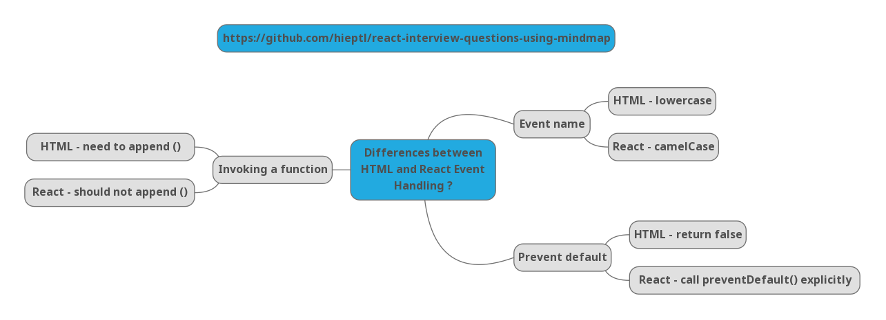

# Crack the React Interviews By Using Mindmap - Part 2.


> Click :star: if you like the project. Pull Request are highly appreciate :heart:

This is the second part in my series (__Crack the React Interviews Using Mindmap__). My series will give you the answers about different React interview questions by using mindmap. Mindmap is a technique that help you remember things easier. It is used by many memory championships, professors, valedictorians and so on.

By applying mindmap, my series will give you the key points for each answer. Hence, you can understand the answer and explain in your React interviews.

I'm Hiep. I work as a full-time software engineer. Most of my open-source projects are focused on one thing - to help people learn 📚.

My post about __Crack the React Interviews by Using Mindmap - Part 2__ on Dev.to: https://dev.to/hieptl/crack-the-react-interviews-by-using-mindmap-part-2-4oi9

> If the repository is useful, please help me share the post and give me a :star:. It will make me feel motivation to work even harder. I will try to make many open sources and share to the community.
>
> I also created some series that help you improve your practical skills:
>
> __1. Learn React By Buiding Netflix__
>
> https://dev.to/hieptl/learn-react-by-building-netflix-1127
>
> __2. Master Design Patterns by Building Real Projects - Javascript.__
>
> https://dev.to/hieptl/series/13039
>
> __3. Master React Ref By Building Real Project__
>
> https://dev.to/hieptl/series/13114
>
> __4. Some Mistakes When Using "This" Keyword in Javascript and Solutions__
>
> https://dev.to/hieptl/some-mistakes-when-using-this-keyword-in-javascript-and-solutions-4j77
>

## __Table of Contents__
| No. | Topics |
| --- | --------- |
|11  | [Why Should We not Update the State Directly?.](#question11) |
|12  | [What is the Purposes of Callback Function as an Argument of setState()?.](#question12) |
|13  | [What are the Differences between HTML and React Event Handling?.](#question13) |
|14  | [How to create Refs?.](#question14) |
|15  | [How to Bind Methods in JSX Callbacks?.](#question15) |
|16  | [How to Pass Parameters to an Event Handlers or Callbacks?.](#question16) |
|17  | [What are Synthetic Events in React?.](#question17) |
|18  | [What are Inline Condition Expressions?.](#question18) |
|19  | [What is Key Prop?.](#question19) |
|20  | [What is the Use of Refs?.](#question20) |

## __Table of Images__
| No. | Topics |
| --- | --------- |
|11  | [Figure 11. Crack the React Interview by Using Mindmap - Question 11.](#figure11) |
|12  | [Figure 12. Crack the React Interview by Using Mindmap - Question 12.](#figure12) |
|13  | [Figure 13. Crack the React Interview by Using Mindmap - Question 13.](#figure13) |
|14  | [Figure 14. Crack the React Interview by Using Mindmap - Question 14.](#figure14) |
|15  | [Figure 15. Crack the React Interview by Using Mindmap - Question 15.](#figure15) |
|16  | [Figure 16. Crack the React Interview by Using Mindmap - Question 16.](#figure16) |
|17  | [Figure 17. Crack the React Interview by Using Mindmap - Question 17.](#figure17) |
|18  | [Figure 18. Crack the React Interview by Using Mindmap - Question 18.](#figure18) |
|19  | [Figure 19. Crack the React Interview by Using Mindmap - Question 19.](#figure19) |
|20  | [Figure 20. Crack the React Interview by Using Mindmap - Question 20.](#figure20) |

<a id="question11"></a>
### 11. Why Should We not Update the State Directly ?

<a id="figure11"></a>


Figure 11. Crack the React Interview by Using Mindmap - Question 11.

```js
//Wrong
this.state.userName = 'Hiep Le'
```

```js
//Correct
this.setState({ userName: 'Hiep Le' });
```

```js
//Correct
const [userName, setUserName] = useState('');
...
setUserName('Hiep Le');
...
```

<a id="question12"></a>
### 12. What is the Purposes of Callback Function as an Argument of setState() ?

<a id="figure12"></a>


Figure 12. Crack the React Interview by Using Mindmap - Question 12.

```js
setState({ userName: 'Hiep Le' }, () => console.log('The userName has been updated and the component was re-rendered'))
```

<a id="question13"></a>
### 13. What are the Differences between HTML and React Event Handling ?

<a id="figure13"></a>


Figure 13. Crack the React Interview by Using Mindmap - Question 13.

HTML - Event name: 

```js
<button onclick='showUserName()'>
```

React - Event Name: 

```js
<button onClick={showUserName}>
```

HTML - preventDefault

```js
<a href='#' onclick='console.log("The link was clicked."); return false;' />
```

React - preventDefault

```js
const handleClick = event => {
  event.preventDefault()
  console.log('The link was clicked.')
}
```

HTML - Invoking Function - Should append (): 

```js
<button onclick='showUserName()'>
```

React - Invoking Function - Should not append (): 

```js
<button onClick={showUserName}>
```

<a id="question14"></a>
### 14. How to Create React Refs ?

<a id="figure14"></a>


Figure 14. Crack the React Interview by Using Mindmap - Question 14.

React.createRef();

```js
import React from 'react';

class UserProfile extends React.Component {
  constructor(props) {
    super(props);
    this.myRef = React.createRef();
  }

  render() {
    return <div ref={this.myRef}></div>
  }
}
```

useRef();

```js
import {useRef} from 'react';

function UserProfile() {
  const myRef = useRef();
  return (
    <div ref={myRef}></div>
  );
}
```

Ref callback

```js
class MyInput extends Component {
   constructor(props) {
      super(props);
      this.input = null;
      this.inputRef = e => {
         this.input = e;
      }
   }
   render() {
      return (
         <input ref={this.inputRef} />
      );
   }
}
```

<a id="question15"></a>
### 15. How to Bind Methods in JSX Callbacks ?

<a id="figure15"></a>


Figure 15. Crack the React Interview by Using Mindmap - Question 15.

Binding in constructor

```js
import React from 'react';
class MyComponent extends React.Component { 
  constructor(props) {
    super(props);
    this.handleClick = this.handleClick.bind(this);
  }

  handleClick() {
    ...
  }
  ...
}
```

Public class field syntax

```js
function MyComponent() {
  const handleClick = () => {
    ...
  };
}
```

Arrow functions in callbacks

```js
import React from 'react';
class MyComponent extends React.Component { 
  constructor(props) {
    super(props);
  }

  handleClick() {
    ...
  }

  render() {
    return (
      <div>
        <button onClick={() => handleClick()}>Click</button>
      </div>
    );
  }
}
```

<a id="question16"></a>
### 16. How to Pass Parameters to an Event Handlers or Callbacks ?

<a id="figure16"></a>


Figure 16. Crack the React Interview by Using Mindmap - Question 6.

Wrap a event handler in an arrow function: 

```js
<button onClick={() => this.handleClick(id)}>Click</button>
```

Use .bind:
```js
<button onClick={() => this.handleClick.bind(this, id)}>Click</button>
```

Pass arguments to a function defined as an arrow function:
```js
const handleClick = (id) => {
  ...
}
...
<button onClick={handleClick(id)}>Click</button>
...
```


<a id="question17"></a>
### 17. What are Synthetic Events in React ?

<a id="figure17"></a>


Figure 17. Crack the React Interview by Using Mindmap - Question 17.

<a id="question18"></a>
### 18. What are Inline Conditional Expressions ?

<a id="figure18"></a>


Figure 18. Crack the React Interview by Using Mindmap - Question 18.

```js
import React from 'react';

class Greeting extends React.Component { 
  constructor(props) { 
    super(props);
  }

  render() {
    <div>
      {this.props.userName ? <p>Hello, {this.props.userName}</p> : <p>Hello, stranger</p>}
    </div>
  }
}
```

<a id="question19"></a>
### 19. What is Key Prop ?

<a id="figure19"></a>


Figure 19. Crack the React Interview by Using Mindmap - Question 19.

```js
import React from 'react';

function Movies({movies}) {
  return (
    <div>
      {
        movies.map(movie => <span key={movie.id}>{movie.name}</span>)
      }
    </div>
  )
}
```

<a id="question20"></a>
### 20. What is the Use of Refs ?

<a id="figure20"></a>


Figure 20. Crack the React Interview by Using Mindmap - Question 20.

This is the end of the second part. I am writing the next parts, you just need to follow my series and we will crack the React interviews together.

Thanks and Best Regards, \
Hiep.


